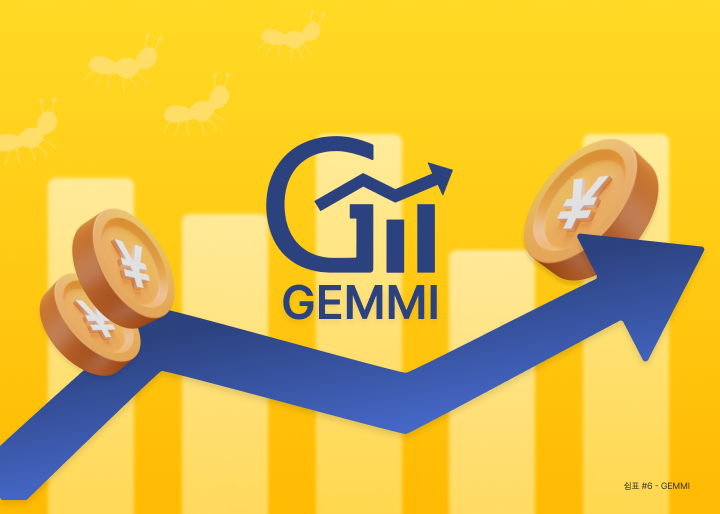
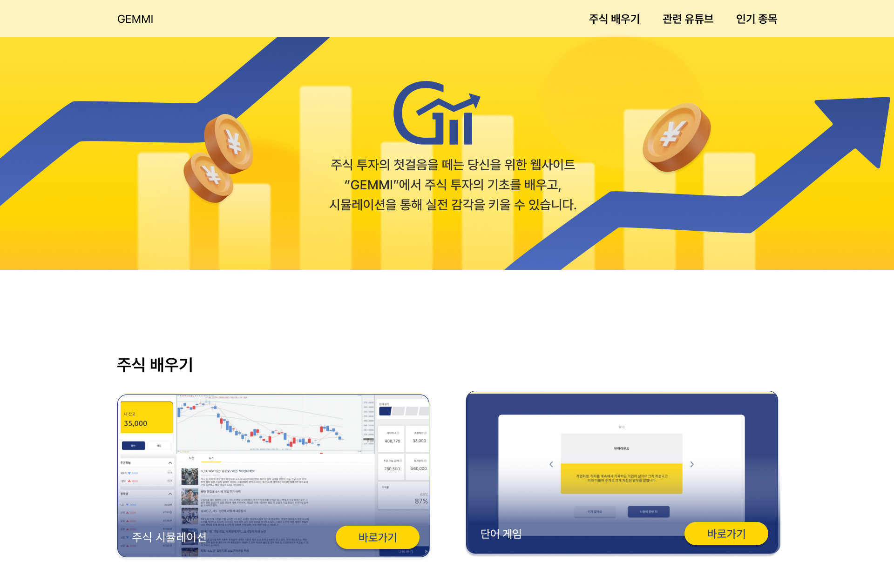
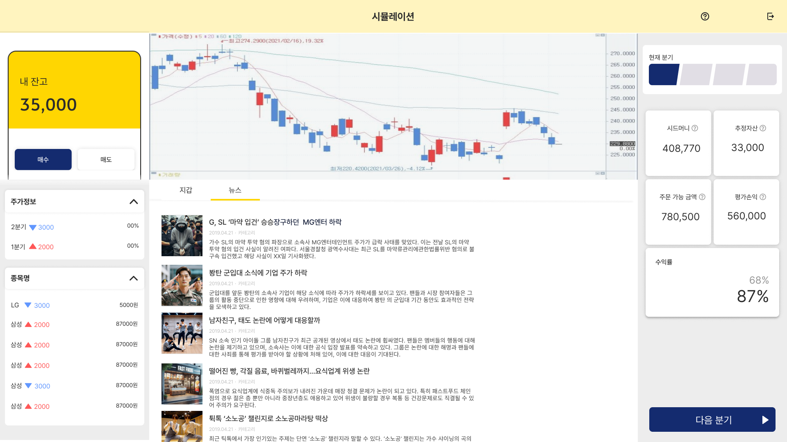

# GEMMI

1. 프로젝트 소개
2. 주요 기능 소개

---
## 프로젝트 소개

 

- 서비스 소개
  
 주식에 대한 관심이 높아지면서 관련 용어들이 많이 등장하는 요즘, 
 GEMMI는 주식을 처음 접하거나 주식 용어에 익숙하지 않은 사람들도 다양한 방법으로 공부하고 배울 수 있는 웹사이트입니다.

- 기획의도
    
     현재 많은 사람들이 주식에 관해 높은 관심을 갖고 있지만, 
금융에 관한 지식 미흡해 주식에 접근하기 어려운 상황입니다. 
따라서 주식을 쉽게 익힐 수 있는 공간을 제공하여,
주식에 대한 어려움을 깨는 데 도움을 주는 웹을 기획했습니다.

- 향후 운영 및 개선
- 
  웹 자체 내에서 주식 영상을 올릴 수 있도록 개선할 계획입니다. 
또한 해외 주식 시장에 대한 정보를 제공하여 글로벌 투자에 대한
이해도를 높이고자  합니다.

- 기술 정보
  
  REACT, EXPRESS.JS, MYSQL, AWS
---

## 주요 기능 소개

- 메인화면

     

- 가상시뮬레이션

게임을 통해 주식 시장에 대해 간단히 이해할 수 있습니다. (참고 : KRX 한국거래소 모의증권투자게임)
     

- 주식 단어 모음집

주식 언어를 익힐 수 있습니다. (참고 : classroom)
     

- 주식 단어 게임
  

주식 언어를 간단한 게임을 통해 익힐 수 있습니다. 
 
   
